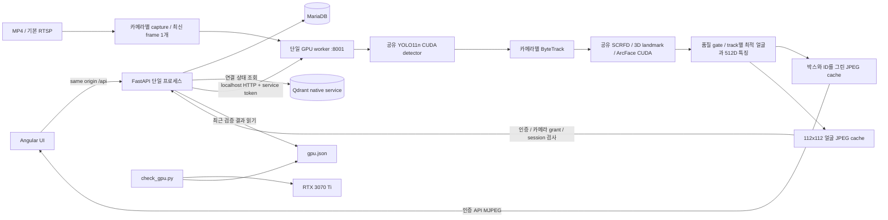

# Architecture

비상업 시험용 프로젝트이며 현재 Phase 3까지 구현했다. 등록 인물 검색/이벤트/자동 재연결은 후속 구현 대상으로 표시한다.

## 현재 구현

- API는 사용자 인증, 최소 role 검사, 카메라 기본 CRUD 및 서비스 상태를 담당한다. GPU inference와 RTSP capture를 로딩하지 않는다.
- DB session cookie는 HttpOnly/SameSite=Strict다. DB에는 token SHA256 및 만료 시각을 저장한다. CSRF token은 cookie token과 private secret으로 HMAC 생성하며 변경 요청에서 검사한다.
- admin은 전체 카메라를 관리한다. 일반 카메라 metadata는 로그인 후 조회하지만, operator/viewer의 영상/분석 상태 접근은 `camera_permissions` grant가 필요하다. operator의 시작·중지에는 조작 grant도 필요하다. 외부 origin의 변경 요청을 차단한다. 공개 health는 liveness이며 연결 상세는 인증 후 조회한다.
- RTSP 전체 URL은 Fernet으로 암호화하여 DB에 저장한다. 조회 응답에서는 userinfo/query/fragment를 제거한다. validation 오류와 SQL 오류는 secrets 없이 보고한다.
- schema는 `users`, `auth_sessions`, `cameras`, `camera_permissions`, `audit_logs`다. Phase 2 migration은 기존 RTSP row에 source type과 optional MP4 경로를 추가한다. Alembic이 schema를 관리하고 API startup이 schema를 자동 생성/초기화하지 않는다.
- Qdrant는 localhost에 바인딩하는 native 바이너리다. Phase 1은 임시 smoke collection을 사용한다. 실제 얼굴 collection/model은 Phase 3~4에서 결정한다.
- native user services는 로그인 사용자의 권한과 프로젝트 working directory로 실행한다. API/worker는 각각 `application.log`/`worker.log`를 rotation한다. native decoder stderr는 RTSP 주소 유출을 막기 위해 worker에서 숨긴다.

## 구현된 GPU worker (Phase 2~3)

API와 GPU worker는 별도 프로세스로 운영한다. worker 하나가 YOLO 모델과 CUDA inference backend를 소유한다. 카메라별 capture thread, latest-frame buffer, tracker를 분리하고 하나의 순차 scheduler에서 모델을 공유한다. 한 순회에서 각 준비된 카메라를 한 번씩 처리하며 목표 cadence는 기본 5 FPS다. admission 상한은 기본 4다. API worker는 하나이며 GPU 라이브러리를 로딩하지 않는다. 얼굴 ONNX session 3개도 같은 worker가 공유한다. 자동 reconnect는 후속 구현이다.

통신은 localhost:8001의 내부 HTTP와 service token을 사용한다. API는 start/stop ACK를 확인한다. start는 `opening`을 반환하며 실제 분석 성공 후 `running`이 된다. source 실패는 secret 없는 code로 보고하고 worker 장애를 성공으로 응답하지 않는다. 변경/업로드/시작/삭제는 카메라별로 직렬화한다. worker는 status와 최신 JPEG를 제공하며 내부 endpoint는 Nginx 공개 proxy에 포함하지 않는다. reference cache 명령은 Phase 4 이후 구현한다.

후속 Phase에서는 worker가 MatchEvent를 DB에 먼저 저장한 후 event_id를 API 내부 endpoint에 전달한다. API는 인증된 WebSocket으로 배포한다. 알림에는 bounded retry를 적용하고 DB event_id 기준 조회로 누락을 복구한다. 초기 API는 단일 Uvicorn 프로세스다. API 다중 프로세스 확장 시에는 모든 API 프로세스로 이벤트를 배포하는 장치를 별도로 구현한다.

## frame, tracking 및 미리보기

현재 camera별 최신 inference 대기 frame은 1개로 제한한다. scheduler는 camera별 처리 기회를 보장하고 queue가 밀리면 오래된 frame을 교체한다. detector confidence의 낮은 cutoff와 tracker의 high/new-track threshold를 구분하여 ByteTrack의 low-score association을 보존한다.

frame 및 분석 결과에는 `camera_id`, `stream_session_id`, `frame_id`, capture timestamp가 있다. UTC는 저장 및 화면 시각, monotonic clock은 latency/timeout 측정에 사용한다. tracker update의 실제 간격과 lost-track 유지 시간을 반영한다.

추적 ID의 유효 범위는 camera + stream session + track이다. ByteTrack의 기본 process-global ID counter를 camera-local counter로 대체하여 다른 카메라 시작이 기존 ID에 영향을 주지 않는다. lost 유지 시간은 기본 3초이며 실제 monotonic 경과 시간으로 만료한다. 기본 5 FPS에 맞게 frame buffer를 15로 변환하고 누락된 분석 tick의 Kalman 예측도 반영한다. identity/DB track/이벤트는 후속 구현이다. 현재 MP4 반복/분석 재시작에서 session UUID를 새로 만들고 이전 identity/cooldown을 이어 붙이지 않는다. DB track에는 독립된 기본키를 부여한다. event dedup key는 `(camera_id, stream_session_id, track_id, person_id)`다.

MVP 영상은 인증된 `/api/cameras/{id}/preview`에서 annotation을 그린 MJPEG를 제한 FPS로 전달한다. 이미 분석한 frame을 재사용하며 viewer마다 capture/inference를 새로 시작하지 않는다. 시청자는 기본 camera당 4명/전체 16명이다. 각 시청자는 캐시된 JPEG를 한 프레임씩 소비하고 ASGI backpressure를 적용하여 큐를 쌓지 않는다. 짧은 DB session으로 2초마다 로그인/계정/카메라 grant를 재확인하고 종료 시 viewer slot을 반환한다. JPEG는 최대 너비 1280으로 제한한다. 이후 WebRTC/HLS를 선택하면 encoding 비용/지연을 측정하고 별도 bbox overlay를 frame timestamp에 맞춘다.

## embedding 및 정확도 평가

얼굴 모델은 공식 buffalo_l v0.7의 SCRFD/1k3d68/ArcFace w600k_r50을 사용한다. 5-point alignment 이후 float32 512차원 L2-normalized embedding과 model SHA/version을 기록한다. cosine similarity 검색은 Phase 4에서 구현한다. 서로 다른 모델의 embedding은 같은 검색 공간에 섞지 않는다. Memory/Qdrant provider는 같은 person 단위 reference 점수 집계 규칙을 따른다.

candidate는 운영자 확인 전 동일인 확정으로 취급하지 않는다. confirmed/rejected event는 운영 피드백이며, threshold 평가에는 등록 인물/미등록 인물/임계값 아래 사례를 포함한 별도 정답 데이터를 사용한다. calibration/evaluation은 영상 또는 촬영 session으로 분리한다. 얼굴 비교 성능과 detection/quality filtering을 포함한 전체 검색의 누락 성능을 구분한다. 정답이 없는 지표는 unavailable로 보고한다.

## 저장 및 정리

Phase 4에서 인물/얼굴의 DB row, Qdrant vector, 이미지 및 worker cache를 정리하는 재시도 가능한 작업 상태를 구현한다. 삭제/비활성화 대상은 즉시 검색에서 제외하고 정리 실패를 다시 처리한다. 이를 여러 저장소에 걸친 원자적 DB transaction으로 취급하지 않는다.

이미지/embedding/event/clip별 retention 기간을 설정하고 cleanup을 실행한다. 파일은 공개 static 경로에서 제공하지 않고 인증과 접근 권한을 검사하는 API로 제공한다.

Phase 8의 clip pre-buffer는 압축 segment의 디스크 보관을 우선 검토한다. 분석용 최신 frame과 녹화용 buffer를 분리하며 camera별 buffer bytes, 전체 저장량, 최소 잔여 디스크 및 cleanup 주기에 상한을 둔다. clip은 pending/ready/failed 상태로 처리하여 후속 녹화가 검색을 막지 않게 한다.

## 실행 조합 및 측정

검증 조합은 Python 3.12.3, PyTorch 2.11.0+cu128, CUDA runtime 12.8, cuDNN 9.19.0, ONNX Runtime GPU 1.26.0 및 driver 575.51.03이다. 작은 ONNX MatMul profile에서 CUDA node 실행을 확인했다. Phase 2에는 실제 YOLO11n CUDA 추론과 1채널 MP4 benchmark를 추가 검증했다. Phase 3에 얼굴 모델 3개의 실제 CUDA convolution과 80회 반복 GPU 실행 및 얼굴 분석을 포함한 1채널 MP4 benchmark를 검증했다. 다중 camera 처리 성능은 아직 검증하지 않았다.

현재 1채널 실시간 MP4 benchmark를 제공하며 얼굴 분석 비용을 포함한다. camera별 source/processed FPS, drop 수, queue 크기, inference 시간 및 capture부터 결과 준비까지의 latency를 기록한다. 1→2→4채널로 확대하고 offline 최대 처리량 모드는 실시간 모드와 구분한다. Phase 9는 다중 camera 확장/최적화 단계다.

## Phase 3 얼굴 분석의 상태와 자원

순차 GPU scheduler는 사람 탐지/추적 후 최소 0.5초 간격으로 해당 person ROI를 얼굴 검사한다. due track을 마지막 검사 시각으로 정렬하여 검사를 배분하고 frame당 4 ROI, camera당 100 face track으로 제한한다. 전체 frame에 매번 얼굴 detector를 실행하지 않는다. face center가 person ROI 위쪽 65%에 있어야 하고 한 ROI에 여러 후보가 있으면 연결을 보류한다. 320×320 SCRFD, 192×192 3D landmark pose 및 112×112 ArcFace를 공유한다.

원본 크기/선명도/밝기, 탐지 confidence, landmark geometry/정렬 오차, pose와 종합 quality를 검사한다. 현재 품질 설정은 heuristic이며 데이터로 보정된 threshold가 아니다. 작은 얼굴은 pose도 생략하고 제외한다. 통과한 얼굴이 이전 best보다 좋아질 때만 512D embedding/JPEG를 새로 만든다. 이전 best가 있으면 현재 검사에 실패해도 그 세션의 best는 유지하며 두 상태를 별도로 응답한다.

`TrackFaces`는 camera/session마다 메모리 안에만 존재한다. first/last seen 및 best의 frame/capture 시각과 모델 버전을 기록한다. API에는 embedding 없이 quality metadata만 전달한다. 로그인/계정 활성 상태와 camera grant를 검사한 thumbnail API는 session UUID가 일치하고 track이 유효할 때만 JPEG를 제공한다. stop/loop/end/error는 tracker와 face 객체 및 JPEG/result를 버린다. 오래된 session의 track ID로 새 얼굴을 조회할 수 없다. GPU inference 동안 run lock을 장시간 보유하지 않고 publish 직전에 cancel/session을 다시 확인한다. 얼굴 box/landmark overlay는 실제 검사한 frame에만 그린다.

ONNX Runtime은 CUDA/cuDNN을 preload하고 매 session startup에서 실제 CUDA Conv profile을 검사한다. 요청된 CUDA가 준비되지 않으면 기본값으로 실패하고 CPU 성공으로 보고하지 않는다. session마다 arena limit 1 GiB, unified CUDA stream, cuDNN workspace 제한과 `enable_mem_pattern=False`/`kNextPowerOfTwo`를 사용한다. 검증 중 pinned ORT/model의 반복 추론에서 arena 고갈을 재현하여 이 설정으로 수정했다. limit은 arena에만 적용되므로 총 GPU 메모리는 NVML로 별도 측정한다. [공식 CUDA provider 설정](https://onnxruntime.ai/docs/execution-providers/CUDA-ExecutionProvider.html)을 참고한다.

품질 데이터/정답 예제의 촬영 group 분리 및 독립 평가 자료의 범위는 [calibration-data.md](calibration-data.md)에 정의했다. Phase 3에는 reference gallery/DB vector/Qdrant 검색/MatchEvent가 없다. Phase 4에서 해당 모델 버전을 기준으로 등록·검색·삭제·보관 정책을 구현한다.
