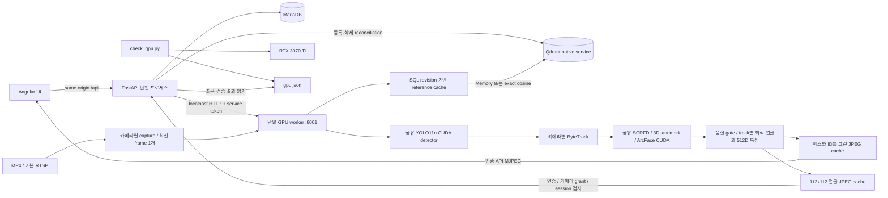
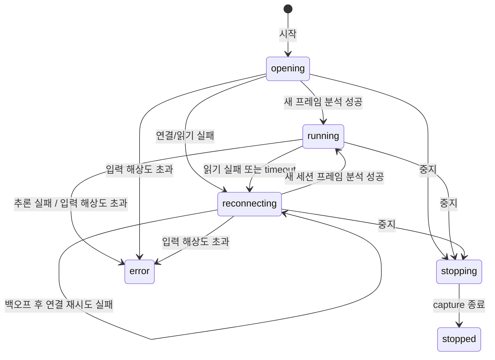
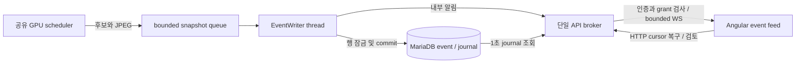

# Architecture

비상업 시험용 프로젝트이며 Phase 7 Angular Live Search UI를 구현하고 서비스에 반영했다. Phase 6의 실제 CUDA 파이프라인/이벤트 저장·복구를 유지하며 카메라·영상·이벤트 3열, 사진 비교와 표시 필터를 제공한다. 전체 backend 96건, 실제 MariaDB 통합 1건, Chrome E2E 8건과 frontend 논리 테스트 16건을 통과했다. 실제 Alembic head는 `0005_match_events`다. 자세한 범위는 [Phase 7 결과](phase7-report.md)를 따른다.

## 현재 구현

- API는 사용자 인증, role/grant 검사, 카메라·인물 CRUD 및 서비스 상태를 담당한다. GPU inference와 RTSP capture를 로딩하지 않는다.
- DB session cookie는 HttpOnly/SameSite=Strict다. DB에는 token SHA256 및 만료 시각을 저장한다. CSRF token은 cookie token과 private secret으로 HMAC 생성하며 변경 요청에서 검사한다.
- admin은 전체 카메라를 관리한다. 일반 카메라 metadata는 로그인 후 조회하지만, operator/viewer의 영상/분석 상태 접근은 `camera_permissions` grant가 필요하다. operator의 시작·중지에는 조작 grant도 필요하다. 외부 origin의 변경 요청을 차단한다. 공개 health는 liveness이며 연결 상세는 인증 후 조회한다.
- RTSP 전체 URL은 Fernet으로 암호화하여 DB에 저장한다. 조회 응답에서는 userinfo/query/fragment를 제거한다. validation 오류와 SQL 오류는 secrets 없이 보고한다.
- schema는 `users`, `auth_sessions`, `cameras`, `camera_permissions`, `audit_logs`, `persons`, `person_faces`, `person_permissions`, `face_gallery_state`, `face_cleanup_jobs`다. Phase 2 migration은 기존 RTSP row에 source type과 optional MP4 경로를 추가한다. Alembic이 schema를 관리하고 API startup이 schema를 자동 생성/초기화하지 않는다.
- Qdrant는 localhost에 바인딩하는 native 바이너리다. Phase 1은 임시 smoke collection을 사용한다. Phase 4의 `face_embeddings`는 512D cosine, owner/model-version metadata로 검증하며 기존 다른 collection을 덮어쓰지 않는다.
- native user services는 로그인 사용자의 권한과 프로젝트 working directory로 실행한다. API/worker는 각각 `application.log`/`worker.log`를 rotation한다. native decoder stderr는 RTSP 주소 유출을 막기 위해 worker에서 숨긴다.

## 구현된 GPU worker (Phase 2~6)

API와 GPU worker는 별도 프로세스로 운영한다. worker 하나가 YOLO 모델과 CUDA inference backend를 소유한다. 카메라별 capture thread, latest-frame buffer, tracker를 분리하고 하나의 순차 scheduler에서 모델을 공유한다. 한 순회에서 각 준비된 카메라를 한 번씩 처리하며 목표 cadence는 기본 5 FPS다. admission 상한은 기본 4이며 재연결 대기도 포함한다. API worker는 하나이며 GPU 라이브러리를 로딩하지 않는다. 얼굴 ONNX session 3개도 같은 worker가 공유한다.

통신은 localhost:8001의 내부 HTTP와 service token을 사용한다. API는 start/stop ACK를 확인한다. start는 `opening`을 반환하며 실제 분석 성공 후 `running`이 된다. source 실패는 secret 없는 code로 보고하고 worker 장애를 성공으로 응답하지 않는다. 변경/업로드/시작/삭제는 카메라별로 직렬화한다. worker는 status와 최신 JPEG를 제공하며 내부 endpoint는 Nginx 공개 proxy에 포함하지 않는다. 등록 사진 추론은 길이 2의 bounded queue를 통해 같은 GPU scheduler에서 카메라 추론과 순차 실행한다. reference reload 명령은 SQL revision 이상을 읽은 ACK를 확인한다.

Phase 6은 worker의 별도 EventWriter thread가 bounded snapshot queue에서 MatchEvent를 DB에 먼저 저장한 후 event_id를 API 내부 endpoint에 전달한다. 저장/알림 각각 최대 3회 재시도하며 GPU scheduler는 기다리지 않는다. API는 인증된 WebSocket으로 배포하며 DB journal을 1초마다 조회해 알림 실패도 복구한다. 신규 event_id 조회와 생성/갱신/검토를 포함한 change_id 조회를 구분한다. 초기 API는 단일 Uvicorn 프로세스다. 다중 프로세스 확장은 별도 검증/구현 범위다.

## frame, tracking 및 미리보기

현재 camera별 최신 inference 대기 frame은 1개로 제한한다. scheduler는 camera별 처리 기회를 보장하고 queue가 밀리면 오래된 frame을 교체한다. detector confidence의 낮은 cutoff와 tracker의 high/new-track threshold를 구분하여 ByteTrack의 low-score association을 보존한다.

frame 및 분석 결과에는 `camera_id`, `stream_session_id`, `frame_id`, capture timestamp가 있다. UTC는 저장 및 화면 시각, monotonic clock은 latency/timeout 측정에 사용한다. tracker update의 실제 간격과 lost-track 유지 시간을 반영한다.

추적 ID의 유효 범위는 camera + stream session + track이다. ByteTrack의 기본 process-global ID counter를 camera-local counter로 대체하여 다른 카메라 시작이 기존 ID에 영향을 주지 않는다. lost 유지 시간은 기본 3초이며 실제 monotonic 경과 시간으로 만료한다. 기본 5 FPS에 맞게 frame buffer를 15로 변환하고 누락된 분석 tick의 Kalman 예측도 반영한다. RTSP 실패, MP4 반복, 분석 재시작에서 session UUID를 새로 만들고 tracker/TrackFaces 전체를 교체한다. frame 번호는 session 안에서 1부터 시작하며 총 처리 통계와 구분한다. 비동기 추론의 publish/예외 처리 모두 session과 cancel을 확인한다. Phase 6의 DB track에는 독립된 기본키를 부여하고 event dedup/cooldown key는 `(camera_id, stream_session_id, track_id, person_id)`다. 기본 30초 submission cooldown은 TrackFaces에 속하며 track 만료/세션 교체 시 제거한다. DB UNIQUE와 event_state 잠금이 동시 후보/재시도의 중복 저장을 방지한다.

MVP 영상은 인증된 `/api/cameras/{id}/preview`에서 annotation을 그린 MJPEG를 제한 FPS로 전달한다. 이미 분석한 frame을 재사용하며 viewer마다 capture/inference를 새로 시작하지 않는다. 시청자는 기본 camera당 4명/전체 16명이다. 각 시청자는 캐시된 JPEG를 한 프레임씩 소비하고 ASGI backpressure를 적용하여 큐를 쌓지 않는다. 짧은 DB session으로 2초마다 로그인/계정/카메라 grant를 재확인하고 종료 시 viewer slot을 반환한다. JPEG는 최대 너비 1280으로 제한한다. 이후 WebRTC/HLS를 선택하면 encoding 비용/지연을 측정하고 별도 bbox overlay를 frame timestamp에 맞춘다.

## RTSP 세션과 재연결 (Phase 5)

FFmpeg backend를 TCP로 열고 open/read timeout을 생성자 params로 지정한다. 기본값은 5/3초이고 OpenCV의 open-only 속성이다. 재시도 간격은 `min(30, 1 × 2^(연속실패-1))`초에 20% jitter를 적용하며 30초를 넘지 않는다. 최대 간격에서도 계속 시도하고 10초 연속 수신 후 실패 횟수를 초기화한다. 대기에는 cancel Event를 사용하여 중지 시 즉시 깨어난다. 진행 중인 OpenCV 연산은 timeout으로 제한하고 그 직후 cancel을 검사한다. [OpenCV 공식 timeout 속성](https://docs.opencv.org/5.0/main_modules/videoio_flags_base.html)을 참고한다.

실패 시 lock 안에서 session UUID를 교체하고 latest/JPEG/result/tracker/faces를 비운다. 현재 연결 시각은 초기화하고 최근 프레임 시각과 누적 통계는 진단용으로 유지한다. 실제 수신과 GPU 분석이 재개될 때 `running`이 되며 복구 횟수를 별도로 표시한다. 이전 session의 JPEG/얼굴 조회는 허용하지 않는다. 내부 frame 응답의 상태/session header로 MJPEG 연결을 끝내 viewer slot을 반환한다. Angular는 session 변경과 running 복귀를 감지해 미리보기를 다시 연결한다.

단일 RTSP 입력의 실제 읽기 timeout·복구·중지·CUDA 얼굴 후보 생성은 공개 MP4를 MediaMTX/FFmpeg로 송출하여 검증한다. 시험 서버는 임시 localhost TCP port만 사용하고 다른 listener는 끈다. 실제 CCTV별 인증 방식/codec/network와 다중 카메라 성능은 이 시험으로 보장하지 않는다. [Phase 5 결과](phase5-report.md)를 참고한다.

## embedding 및 정확도 평가

얼굴 모델은 공식 buffalo_l v0.7의 SCRFD/1k3d68/ArcFace w600k_r50을 사용한다. 5-point alignment 이후 float32 512차원 L2-normalized embedding과 model SHA/version을 기록한다. Phase 4는 cosine similarity를 계산하고 인물별 최대 reference score로 집계한다. 서로 다른 모델의 embedding은 같은 검색 공간에 섞지 않는다. Memory/Qdrant provider는 같은 person 단위 reference 점수 집계 규칙을 따른다.

candidate는 운영자 확인 전 동일인 확정으로 취급하지 않는다. confirmed/rejected event는 운영 피드백이며, threshold 평가에는 등록 인물/미등록 인물/임계값 아래 사례를 포함한 별도 정답 데이터를 사용한다. calibration/evaluation은 영상 또는 촬영 session으로 분리한다. 얼굴 비교 성능과 detection/quality filtering을 포함한 전체 검색의 누락 성능을 구분한다. 정답이 없는 지표는 unavailable로 보고한다.

## 저장 및 정리

Phase 4의 durable `face_cleanup_jobs`는 인물별 원하는 상태를 DB에 먼저 commit한 후 worker ACK/Qdrant/vector/file/DB 정리를 수행한다. 삭제/비활성화 대상은 즉시 검색에서 제외하고 정리 실패를 다시 처리한다. 이를 여러 저장소에 걸친 원자적 DB transaction으로 취급하지 않는다.

이미지/embedding/event/clip별 retention 기간을 설정하고 cleanup을 실행한다. 파일은 공개 static 경로에서 제공하지 않고 인증과 접근 권한을 검사하는 API로 제공한다.

Phase 8의 clip pre-buffer는 압축 segment의 디스크 보관을 우선 검토한다. 분석용 최신 frame과 녹화용 buffer를 분리하며 camera별 buffer bytes, 전체 저장량, 최소 잔여 디스크 및 cleanup 주기에 상한을 둔다. clip은 pending/ready/failed 상태로 처리하여 후속 녹화가 검색을 막지 않게 한다.

## 실행 조합 및 측정

검증 조합은 Python 3.12.3, PyTorch 2.11.0+cu128, CUDA runtime 12.8, cuDNN 9.19.0, ONNX Runtime GPU 1.26.0 및 driver 575.51.03이다. 작은 ONNX MatMul profile에서 CUDA node 실행을 확인했다. Phase 2에는 실제 YOLO11n CUDA 추론과 1채널 MP4 benchmark를 추가 검증했다. Phase 3에 얼굴 모델 3개의 실제 CUDA convolution과 80회 반복 GPU 실행 및 얼굴 분석을 포함한 1채널 MP4 benchmark를 검증했다. 다중 camera 처리 성능은 아직 검증하지 않았다.

현재 1채널 실시간 MP4 benchmark를 제공하며 얼굴 분석 비용을 포함한다. camera별 source/processed FPS, drop 수, queue 크기, inference 시간 및 capture부터 결과 준비까지의 latency를 기록한다. 1→2→4채널로 확대하고 offline 최대 처리량 모드는 실시간 모드와 구분한다. Phase 9는 다중 camera 확장/최적화 단계다.

## Phase 3 얼굴 분석의 상태와 자원

순차 GPU scheduler는 사람 탐지/추적 후 최소 0.5초 간격으로 해당 person ROI를 얼굴 검사한다. due track을 마지막 검사 시각으로 정렬하여 검사를 배분하고 frame당 4 ROI, camera당 100 face track으로 제한한다. 전체 frame에 매번 얼굴 detector를 실행하지 않는다. face center가 person ROI 위쪽 65%에 있어야 하고 한 ROI에 여러 후보가 있으면 연결을 보류한다. 320×320 SCRFD, 192×192 3D landmark pose 및 112×112 ArcFace를 공유한다.

원본 크기/선명도/밝기, 탐지 confidence, landmark geometry/정렬 오차, pose와 종합 quality를 검사한다. 현재 품질 설정은 heuristic이며 데이터로 보정된 threshold가 아니다. 작은 얼굴은 pose도 생략하고 제외한다. 통과한 얼굴이 이전 best보다 좋아질 때만 512D embedding/JPEG를 새로 만든다. 이전 best가 있으면 현재 검사에 실패해도 그 세션의 best는 유지하며 두 상태를 별도로 응답한다.

`TrackFaces`는 camera/session마다 메모리 안에만 존재한다. first/last seen 및 best의 frame/capture 시각과 모델 버전을 기록한다. API에는 embedding 없이 quality metadata만 전달한다. 로그인/계정 활성 상태와 camera grant를 검사한 thumbnail API는 session UUID가 일치하고 track이 유효할 때만 JPEG를 제공한다. stop/loop/end/error는 tracker와 face 객체 및 JPEG/result를 버린다. 오래된 session의 track ID로 새 얼굴을 조회할 수 없다. GPU inference 동안 run lock을 장시간 보유하지 않고 publish 직전에 cancel/session을 다시 확인한다. 얼굴 box/landmark overlay는 실제 검사한 frame에만 그린다.

ONNX Runtime은 CUDA/cuDNN을 preload하고 매 session startup에서 실제 CUDA Conv profile을 검사한다. 요청된 CUDA가 준비되지 않으면 기본값으로 실패하고 CPU 성공으로 보고하지 않는다. session마다 arena limit 1 GiB, unified CUDA stream, cuDNN workspace 제한과 `enable_mem_pattern=False`/`kNextPowerOfTwo`를 사용한다. 검증 중 pinned ORT/model의 반복 추론에서 arena 고갈을 재현하여 이 설정으로 수정했다. limit은 arena에만 적용되므로 총 GPU 메모리는 NVML로 별도 측정한다. [공식 CUDA provider 설정](https://onnxruntime.ai/docs/execution-providers/CUDA-ExecutionProvider.html)을 참고한다.

품질 데이터/정답 예제의 촬영 group 분리 및 독립 평가 자료의 범위는 [calibration-data.md](calibration-data.md)에 정의했다. Phase 4는 해당 모델 버전으로 등록·검색·삭제·보관 정책을 적용한다. Phase 6은 같은 모델을 사용한 MatchEvent 저장 코드를 추가했다.

## Phase 6 이벤트 저장과 전달

event_state 잠금 아래 ID를 발급하고 이벤트·변경 journal을 함께 commit해 cursor와 commit 순서를 맞춘다. candidate 사진 개선은 같은 event_id를 갱신하고 change_id를 증가시킨다. 확인/거부 후에는 자동 추론이 사진/상태를 덮어쓰지 않는다. 검토 API는 현재 계정과 카메라 운영·인물 조회 권한 및 CSRF를 검사하고 감사 로그를 같은 transaction에서 저장한다.

얼굴과 그 관측의 압축 frame을 data/events에 private JPEG로 보관한다. 한 tick의 frame JPEG는 여러 best face가 공유한다. image 7일/event 30일, 저장 한도 500 MB/50,000건, 저장 queue 32건이 기본이다. TTL/deleting/삭제 상태는 조회 즉시 차단하며 30초마다 최대 200건을 정리한다. commit 응답 유실은 파일을 보존하고 1시간 지난 orphan을 SQL 기준으로 정리한다.

WebSocket은 정확한 allowed Origin과 로그인 cookie를 확인하며 전송/2초 heartbeat마다 새 transaction으로 계정/카메라·인물 grant를 검사한다. 연결당 queue 64개/전체 32개/send timeout 5초이며 초과는 1013으로 종료한다. Angular는 event_id별 가장 큰 change_id를 유지하고 HTTP next_cursor로 누락을 복구한다. 재접속·권한 변경·30초 snapshot 조회 및 logout의 늦은 응답을 구분한다. native 적용/측정 한계와 API 규칙은 [Phase 6 결과](phase6-report.md)에 기록했다.

## Phase 7 Live Search 표시

Angular는 카메라의 현재 `can_view`/`can_operate`와 이벤트의 `can_review`를 사용하여 목록과 조작을 제공한다. 서버는 기존 cookie/CSRF/카메라·인물 grant를 다시 검사한다. 선택 카메라는 hash URL에 저장하고 최신 목록에서 복원한다. 상태 요청은 카메라/페이지 세대를 확인하고 목록 요청은 로그인 세대를 확인하여 늦은 응답을 차단한다. 기본 갱신 간격은 상태 2초, 카메라/등록 얼굴 30초다.

MJPEG의 bbox/track ID는 같은 분석 JPEG에 포함한다. 인물 grant로 걸러진 후보 이름/수는 중앙 얼굴 카드와 후보 수에 표시하고 MJPEG에 인물 이름을 추가하지 않는다. 오른쪽 현재 등록 얼굴은 ready/이미지 유효 reference 중 품질 우선 대표 사진이며 검출 당시 reference snapshot을 의미하지 않는다. 두 사진 모두 기존 인증 endpoint를 사용하고 실패 시 안내로 전환한다.

카메라/인물 이름/상태 필터는 최대 100개 이벤트의 표시만 바꾼다. EventFeed의 map/buffer 및 HTTP cursor 복구를 필터와 분리하여 숨겨진 이벤트의 변경도 처리한다. 필터 없는 전체 보관 기록 검색과 클립 저장은 이번 UI에 추가하지 않았다.

## Phase 4 reference gallery 및 수명

API는 등록 사진 원본을 private service-token HTTP로 worker에 전달한다. JPEG/PNG만 직접 디코딩하고 크기/픽셀/animation 상한을 load 전에 검사한다. Ultralytics가 monkey-patch한 `Image.open`의 HEIF 자동 설치 경로를 사용하지 않는다. 얼굴 0개/여러 개를 거절하고 동일한 품질 gate 및 ArcFace를 적용한다. GPU 작업은 기존 shared scheduler에서 실행한다. worker만 모델과 복호화한 reference cache를 소유하며 API 응답에는 이미지 경로/vector/embedding ID를 포함하지 않는다.

cache key는 `(gallery revision, 아직 유효한 reference ID 목록)`이다. revision과 reference 자격은 SQL에서 확인하고 바뀐 경우만 특징을 읽어 복호화한다. expiry도 key를 바꾸므로 maintenance 전에 만료 특징을 제외한다. Memory는 normalized dot product, Qdrant는 동일 모델 및 SQL whitelist를 사용한 exact query로 모든 유효 reference 점수를 구한다. 동일 인물 max score/동률 face ID 및 person ID 순서를 공유한다. auto 기준은 전체 유효 reference 200개이며 그 이상에서는 Qdrant다. 큰 reference 수에서 exact scan 비용은 후속 최적화 대상이다.

실시간 track은 best embedding 또는 gallery key가 변경되면 후보를 다시 계산한다. 공개 camera/system 상태와 사진 검색 결과는 현재 SQL revision, 인물 활성·삭제 상태, 특징 만료 및 계정 grant를 다시 검사한다. worker 결과 revision이 오래되면 후보를 비우고 `syncing`으로 보고한다. 검색 저장소 오류는 카메라 자체 탐지를 중지하지 않고 `unavailable`로 보고한다.

등록은 pending row/file/job commit → Qdrant upsert → ready/revision commit → worker ACK 순서다. 마지막 ACK가 실패하면 pending으로 되돌리고 재시도한다. 삭제는 deleting 상태를 먼저 commit해 API와 검색에서 즉시 제외하고 worker cache ACK/vector delete/file unlink/DB delete를 재시도한다. disable은 SQL eligibility를 즉시 차단하고 Qdrant payload와 cache를 갱신한다. `202` 응답으로 미완료를 표시한다. 인물 상태 변경/업로드/cleanup은 단일 API 프로세스의 공통 RLock으로 직렬화한다. 다중 API 프로세스는 지원하지 않는다.

이미지/특징 retention은 각각 기본 30일이며 새 등록에 적용한다. cleanup은 기본 30초마다 최대 200개의 만료 row를 확인하고 20개 인물 job을 처리한다. 각 job은 해당 인물의 모든 reference를 idempotent하게 reconcile한다. 정리 실패는 제한 backoff로 재시도하고 메타데이터나 private 값은 로그에 기록하지 않는다. 디렉터리 0700/JPEG 0600, 200 MB 저장 한도, 500 MB 최소 여유 공간을 적용한다. 원본·EXIF를 보관하지 않으며 112×112 JPEG만 저장한다. Fernet 암호화 특징의 현재 키는 RTSP 키와 공유한다. 파일 쓰기 후 commit 실패는 즉시 삭제, 프로세스 종료로 생긴 orphan은 1시간 후 정리한다. 완료 job은 7일 후 정리하며 감사 로그는 유지한다.
